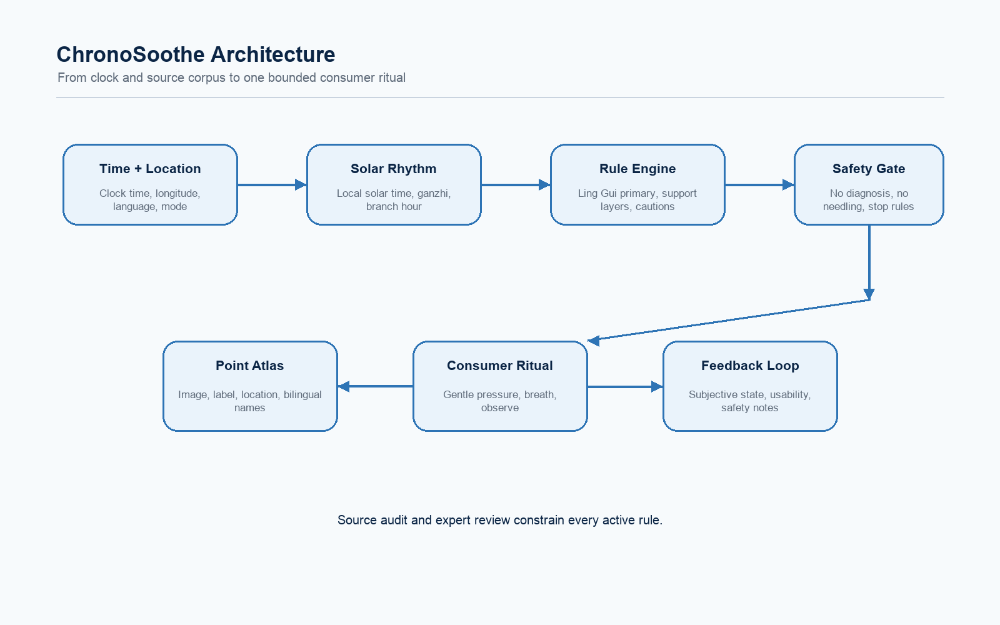
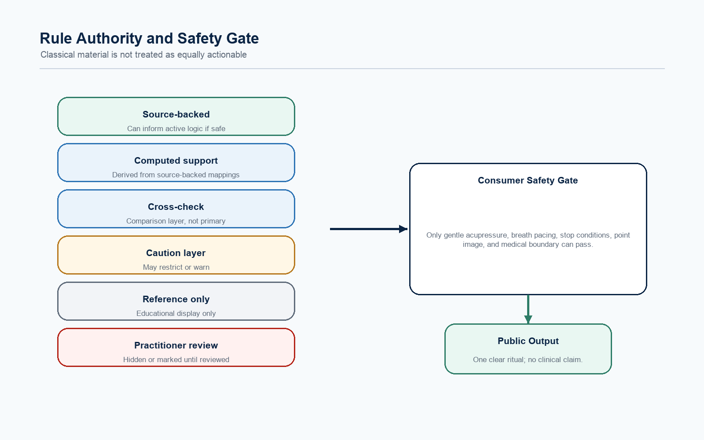
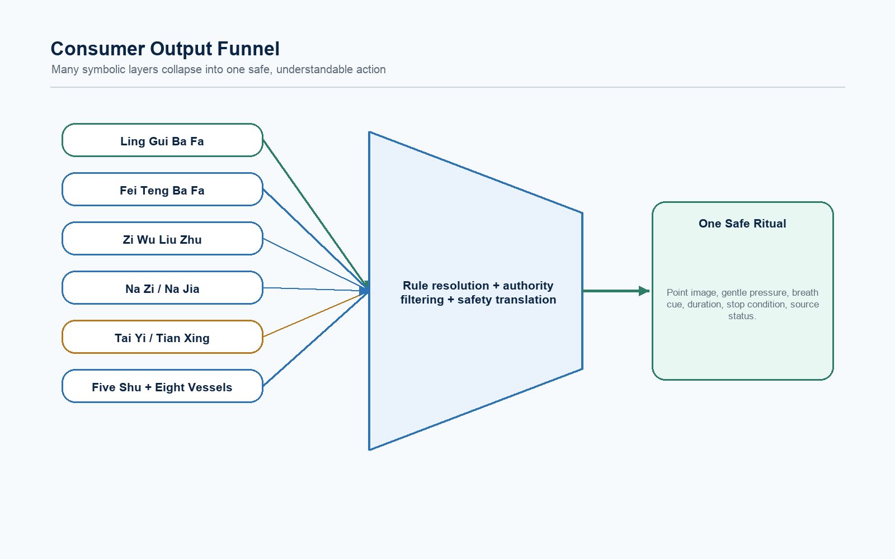
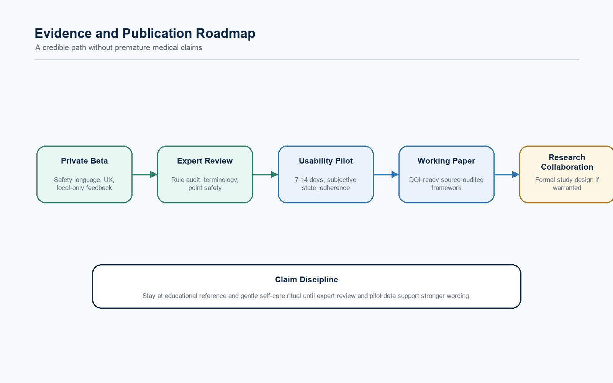

# ChronoSoothe

## A Source-Audited Spatio-Temporal Meridian Timing Framework for Safe Consumer Acupressure Guidance

**Whitepaper v1.1 public review draft**  
**Date:** 2026-06-08  
**Author:** ChronoSoothe Research Group  
**Status:** Public research draft for expert review, product diligence, usability testing, and safety review

---

## Abstract

ChronoSoothe is a source-audited framework for translating selected classical East Asian acupoint timing systems into a safe, explainable, non-invasive self-care interface. It models methods such as Ling Gui Ba Fa, Fei Teng Ba Fa, Zi Wu Liu Zhu, Na Zi, Na Jia, Five Shu point theory, Eight Vessel confluence points, ganzhi cycles, Five Phase correspondences, Bagua mappings, and early Zhu-style spacetime acupuncture architecture as computational rule and interpretation layers with explicit authority status.

The consumer output is intentionally limited to gentle acupressure, breath pacing, body awareness, point-location education, stop conditions, and professional-care escalation. ChronoSoothe does not claim clinical efficacy, does not diagnose disease, and does not provide needling, moxibustion, bloodletting, or treatment guidance.

中文摘要：ChronoSoothe 是一个将传统时空取穴、干支节律与经穴映射数字化为安全、可解释、非侵入式自我照护界面的来源审计框架。系统严格区分可执行算法、交叉校验、参考层、专业层与待审计层。大众端只输出温和穴位按压、呼吸节律、定位学习、停止条件与就医提示，不提供针刺、艾灸、放血、诊断或治疗指导。

---

## 1. Positioning and Non-Claims

ChronoSoothe is not an “AI acupuncture doctor.” It is better understood as a source-audited timing-to-ritual translation system.

The current public positioning is:

> A no-pulse, source-audited spatio-temporal acupressure guidance framework for non-invasive self-care.

The project does not provide:

- disease diagnosis
- disease treatment
- clinical decision support
- needle insertion guidance
- moxibustion or heated therapy instructions
- bloodletting guidance
- emergency-care guidance
- claims that the system has proven clinical efficacy

The consumer-facing product is constrained to:

- gentle acupressure
- breath pacing
- body awareness
- point-location education
- stop conditions
- professional-care escalation
- source transparency
- optional subjective feedback tracking

This whitepaper uses computational language to describe rule encoding and interface design. It does not claim that encoded classical rules are physiologically validated by modern clinical evidence.

---

## 2. Product Thesis

Modern wellness tools often acknowledge rhythms: sleep-wake cycles, stress patterns, digestion patterns, daily energy changes, seasonal effects, and subjective shifts across time. Yet most consumer interfaces provide static recommendations.

Classical East Asian medical traditions preserve sophisticated timing frameworks, including:

- Ling Gui Ba Fa
- Fei Teng Ba Fa
- Zi Wu Liu Zhu
- Na Zi
- Na Jia
- Five Shu point theory
- Eight Vessel confluence points
- ganzhi cycles
- Five Phase and Bagua correspondences
- Tai Yi caution concepts
- Tian Xing classical point sets
- Zhu-style spacetime acupuncture architecture

These methods are powerful as cultural, historical, and computational knowledge systems, but they are difficult to translate safely:

- source material is dense and lineage-dependent
- methods can conflict
- many instructions assume a trained practitioner
- pulse, tongue, palpation, constitution, and clinical diagnosis cannot be performed by a consumer app
- historical needling, moxa, reinforcing/reducing, and taboo rules can be unsafe if literalized
- Western users may distrust mystical or overclaiming language

ChronoSoothe addresses this by separating three questions:

1. What can be computed?
2. What is source-backed?
3. What is safe to show to a consumer?

---

## 3. No-Pulse Product Focus

ChronoSoothe cannot perform pulse diagnosis, tongue diagnosis, palpation, facial inspection, or clinician observation. Therefore, the consumer product prioritizes systems that can be derived from:

- clock time
- longitude and local mean solar time
- ganzhi cycles
- double-hour rhythm
- body-space orientation
- event-time anchors
- user-selected concern category
- point atlas education

Lineages that require pulse, constitution diagnosis, causative-factor assessment, complex syndrome differentiation, or direct practitioner judgement remain professional-only or reference-only until reviewed.

This no-pulse focus is not a weakness; it is a safety boundary. It prevents the app from pretending to perform clinical reasoning it cannot actually perform.

---

## 4. System Overview

ChronoSoothe has five layers:

1. **Temporal layer**  
   Converts clock time and longitude into local mean solar time and maps it into ganzhi, double-hour, seasonal, Five Phase, and trigram contexts.

2. **Classical rule engine**  
   Encodes source-backed timing rules and separates active logic from support, cross-check, reference, and professional-only logic.

3. **Authority and safety gate**  
   Prevents unaudited or practitioner-only material from becoming consumer-facing instructions.

4. **Point atlas layer**  
   Provides bilingual point names, codes, plain-language location guidance, and educational images.

5. **AI explanation and research layer**  
   Explains structured outputs, collects optional subjective feedback, and supports future expert review without diagnosing or inventing prescriptions.



---

## 5. Temporal Normalization

ChronoSoothe uses local mean solar time for v1 timing normalization.

Let:

- `T_utc` be UTC time
- `lambda` be longitude in degrees
- `T_solar_mean` be local mean solar time

The simplified conversion is:

```text
T_solar_mean = T_utc + lambda / 15
```

This corrects for longitude but does not include the astronomical equation of time. Therefore, v1 should say “local mean solar time,” not “true solar time.”

Once local mean solar time is computed, the system maps it into:

- daily ganzhi cycle
- double-hour branch
- hour ganzhi
- Five Phase metadata
- Bagua metadata
- approximate seasonal context

Before clinical or research-grade timing claims, the solar-term and astronomical logic should be compared against a dedicated astronomical library.

---

## 6. Classical Rule Encoding

### 6.1 Ling Gui Ba Fa

Ling Gui Ba Fa is the primary v1 recommendation engine because its numeric residue procedure and Eight Vessel point routing can be traced to the selected source corpus.

The v1 engine encodes:

- day stem and branch values
- hour stem and branch values
- yin/yang day divisor rule
- residue mapping
- Eight Vessel opening point and paired point

Simplified residue process:

```text
S = value(day stem) + value(day branch) + value(hour stem) + value(hour branch)

R = S mod 9  for yang days
R = S mod 6  for yin days
```

If `R = 0`, the divisor value is used as the effective remainder.

In v1, this is the only timing layer allowed to drive the main consumer recommendation.

### 6.2 Fei Teng Ba Fa

Fei Teng Ba Fa is represented conservatively as a Bagua / Nine Palace / Eight Vessel cross-check layer.

v1 does not use an independent heavenly-stem-to-point Fei Teng engine unless a specific source table and lineage interpretation are reviewed. Displaying a diagram-supported relationship is not the same as authorizing it as an active recommendation engine.

### 6.3 Zi Wu Liu Zhu

Zi Wu Liu Zhu appears as:

- double-hour meridian context
- fixed-point table reference where source-backed
- explanatory rhythm layer

It does not override the Ling Gui Ba Fa primary recommendation in v1.

### 6.4 Na Zi and Na Jia

Na Zi maps earthly branches to meridians. Na Jia maps heavenly stems to meridians.

In v1, these layers are source-backed as mapping systems but only cross-check or support layers for consumer display. Any computed Five Shu support point must be labeled as computed support, not as a direct classical prescription.

### 6.5 Five Shu, Yuan-Luo-Xi-Hui, and Eight Vessel Points

These point categories provide structured metadata and educational context. They may help explain why a point is meaningful, but they do not automatically create a consumer recommendation unless connected to an approved active rule layer.

### 6.6 Tai Yi and Tian Xing

Tai Yi is represented only as a seasonal or calendar caution layer in v1. Tian Xing is represented as a classical twelve-point reference set. Neither functions as a standalone timed prescription engine.

### 6.7 Zhu-Style Spacetime Acupuncture Architecture

Zhu-style spacetime acupuncture introduces a multi-anchor structure that can include:

- birth time
- onset or event time
- surgery, trauma, or memory-time anchor
- current consultation time
- body-space correspondence
- time point
- space point
- base layer
- target layer

ChronoSoothe can represent this architecture as an educational and computational scaffold, but a complete Zhu-style treatment sequence may require practitioner judgement, sex/side rules, memory selection, clinical context, and source-specific method sequencing. Therefore, v1 uses Zhu-style concepts as an architecture layer, not as a fully automated clinical treatment plan.

---

## 7. Authority Model

Every rule receives an authority status:

| Status | Meaning | Consumer authority |
| --- | --- | --- |
| Executable | Source-backed and tested enough to drive the main gentle self-care action | May output one consumer ritual |
| Cross-check | Source-backed or computed support used to compare or explain signals | May explain, but does not override |
| Reference | Educational, atlas, caution, or theory layer | No active recommendation |
| Professional-only | Requires clinician judgement, unsafe modality, or unresolved lineage logic | No automatic output |
| Hold | Source or mapping issue unresolved | Hidden from public recommendation |



Current public authority summary:

| Method | Status | Consumer role |
| --- | --- | --- |
| Ling Gui Ba Fa | Executable | Primary timing point |
| Fei Teng Ba Fa | Cross-check | Bagua / Eight Vessel support |
| Zi Wu Liu Zhu | Cross-check | Time-channel context |
| Na Zi | Cross-check | Branch-channel context |
| Na Jia | Cross-check | Stem-channel context |
| Tai Yi | Reference | Caution only |
| Tian Xing | Reference | Point-set atlas only |
| Zhu-style spacetime architecture | Reference / in audit | Multi-anchor explanation |
| Master Tung, Five Element, Huangdi Neizhen, Tian Yi Shen Zhen | Professional-only | No automatic consumer point output |

---

## 8. Safety Translation Layer

Traditional acupoint systems include clinical concepts that are inappropriate for consumer software. ChronoSoothe translates only a safe subset.

The consumer ritual is constrained to:

```text
Find the point.
Use gentle pressure.
Breathe slowly.
Observe sensation.
Stop if discomfort appears.
Seek professional care when symptoms are serious.
```

Excluded from consumer guidance:

- needle depth
- needle angle
- reinforcing or reducing technique
- clockwise or counterclockwise manipulation
- bloodletting
- moxibustion heat application
- disease-specific treatment claims
- strong stimulation
- herbal formula instructions

Safety cautions include:

- pregnancy
- bleeding disorders
- anticoagulant use
- active infection
- wounds, swelling, fractures, or skin damage near a point
- implanted medical devices
- severe or rapidly worsening symptoms
- chest pain, trouble breathing, stroke-like symptoms, fainting, or major injury



---

## 9. AI Layer

AI can be useful only if constrained by structured source and safety data.

AI may:

- explain why a point appears
- translate classical terms into beginner language
- summarize source status
- adapt tone for English or Chinese users
- help users reflect on optional self-reported feedback
- identify when professional care is more appropriate

AI must not:

- diagnose disease
- prescribe treatment
- infer hidden medical conditions
- override safety rules
- invent source authority
- generate unsupported point recommendations
- recommend self-needling, moxibustion, or bloodletting

Every AI explanation should be grounded in a structured output such as:

```json
{
  "primaryPoint": "SI3 Houxi",
  "ruleLayer": "Ling Gui Ba Fa",
  "sourceStatus": "source-backed",
  "consumerAction": "gentle pressure",
  "duration": "30-60 seconds",
  "stopCondition": "pain, numbness, dizziness, distress",
  "clinicalClaim": false
}
```

---

## 10. Product Architecture

The consumer experience should be simple:

1. Confirm time and optional location.
2. Show one primary point.
3. Explain how to locate it.
4. Guide a short, gentle press-and-breathe ritual.
5. Show stop conditions.
6. Allow optional feedback.
7. Keep advanced source/rhythm details in an expandable area.

The user should not be forced to compare many schools at once. Multi-school, lineage, audit, and practitioner material should be separated from the main daily ritual.

---

## 11. Evidence Gap Matrix

ChronoSoothe separates several kinds of evidence:

| Evidence type | Current status | What is still needed |
| --- | --- | --- |
| Classical source presence | In progress | page-level expert audit |
| Algorithm correctness | In progress | test vectors and reviewer sign-off |
| Consumer safety wording | In progress | safety review and usability testing |
| Point-location usability | In progress | user pilot with image comprehension |
| Subjective wellness feedback | Not yet established | private pilot data |
| Clinical efficacy | Not claimed | formal clinical collaboration and study design |

The current project should remain at educational and gentle self-care claim levels until pilot data and expert review exist.

---

## 12. Publication Strategy

Recommended sequence:

1. Public GitHub research repository.
2. Expert review packet.
3. Private usability pilot.
4. Revised whitepaper with audit notes.
5. Zenodo or OSF working paper archive.
6. Academic preprint only after references, expert review, and pilot framing are stronger.

An early public version should present the work as computational humanities, HCI, wellness safety engineering, and classical knowledge digitization, not as a clinical efficacy paper.

---

## 13. Research Roadmap



Near-term priorities:

- complete source audit workbook
- add expert reviewer notes
- publish safety boundaries
- run a 5-user usability pilot
- collect confusion, trust, and point-location feedback
- revise language that sounds too medical or too mystical
- build bilingual point atlas quality review

Medium-term priorities:

- compare local mean solar time with true solar time options
- expand test vectors for Ling Gui Ba Fa
- audit Fei Teng, Na Zi, Na Jia variants
- build a structured Zhu-style multi-anchor case builder
- create practitioner-only review mode

Long-term priorities:

- observational wellness study
- source-corpus versioning
- privacy-preserving feedback dataset
- external advisor board
- optional open-source algorithm package after IP and safety review

---

## 14. Release Readiness Checklist

Before public beta:

- [ ] Ling Gui Ba Fa test vectors reviewed
- [ ] local mean solar time terminology corrected everywhere
- [ ] source audit workbook filled by at least one qualified reviewer
- [ ] unsafe modalities blocked in consumer UI
- [ ] point images reviewed for clarity
- [ ] bilingual terminology reviewed
- [ ] safety disclaimer visible
- [ ] no clinical efficacy claims
- [ ] usability pilot protocol approved
- [ ] emergency escalation copy tested

---

## 15. Closing Note

ChronoSoothe’s defensibility is not hidden in a secret formula. Its defensibility comes from disciplined translation: source before algorithm, safety before completeness, explainability before mystery, and one gentle consumer action before encyclopedic display.

The goal is not to flatten classical medicine into an app. The goal is to create a transparent, humble, reviewable bridge between traditional timing knowledge and modern self-care design.
